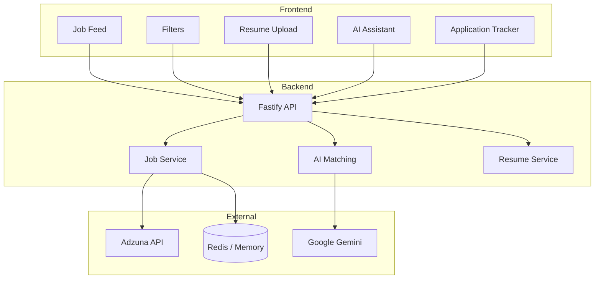

# JobMatch AI
Production-style full-stack application demonstrating AI integration, caching strategies, and scalable backend design.

<div align="center">


**AI-powered job matching platform that scores resume relevance against real job listings.**

[Live Demo](https://smart-job-tracker-ochre.vercel.app) • [Backend API](https://smart-job-tracker-backend-r5wd.onrender.com) • [GitHub](https://github.com/Sarfarazsfz/smart-job-tracker)

</div>

---

## What is this?

JobMatch AI is an AI-assisted job discovery platform that analyzes resumes and ranks job listings based on relevance. Instead of manually evaluating hundreds of listings, users receive a quantified match score to prioritize applications more effectively.

The system connects resumes to live job listings and uses AI to calculate a relevance score for each job.

> **Demo tip:** The AI matching only activates after you upload a resume.

---

## Screenshots

### 🖥️ Job Feed with AI Match Scores


### 📄 Resume Upload & Best Matches


### 🤖 AI Assistant Chat


### 📋 Application Tracker


---

## Features

**The core loop is simple:** browse jobs → upload resume → see your match scores → apply to the right ones → track where you've applied.

**Job Discovery**
- Live job feed from Adzuna API (India-focused listings)
- Filter by role, skills, date posted, job type, work mode, location, and match score
- Filters run client-side so they feel instant with no extra API calls

**AI Matching**
- Upload your resume (PDF or TXT)
- Gemini scores every job on a 0–100% scale using a weighted formula: skills (45%), experience level (30%), title relevance (25%)
- "Best Matches for You" surfaces your top results at the top of the feed
- Scores are calculated once on upload and reused — no repeated API calls while you filter

**Application Tracking**
- Smart popup when you return from an external job portal
- Asks: "Did you apply?" — because the browser can't track what happens on LinkedIn or a company site
- Honest tracking without any privacy workarounds

**AI Assistant**
- Conversational chat for job discovery and career guidance
- Powered by Gemini

---

## Tech Stack

| Layer | Tech |
|---|---|
| Frontend | React, Vite, JavaScript, CSS |
| Backend | Node.js, Fastify |
| AI | Google Gemini API |
| Caching | Upstash Redis (in-memory fallback) |
| Job Data | Adzuna API |
| Hosting | Vercel (frontend), Render (backend) |

---

## Design Goals

- Fast job relevance scoring
- Minimize external API calls using caching
- Stateless backend for scalability
- Clean separation of frontend and backend

## Key Engineering Decisions
---

**Cache-first architecture**

Job listings are cached in Redis to reduce API calls, improve latency, and avoid rate limits.

**Stateless backend**

Backend does not store session state, allowing horizontal scaling.

**Single-pass AI scoring**

Resume is processed once, and results are reused to avoid repeated AI calls and reduce cost.

**Client-side filtering**

Filtering happens on the frontend for instant UX and reduced backend load.

## Architecture

The system follows a three-layer architecture separating frontend, backend, and external service responsibilities.



---
## Data Flow

1. User uploads resume from frontend
2. Resume sent to backend API
3. Backend extracts skills and keywords
4. Backend fetches job listings
5. AI service calculates match scores
6. Results stored in Redis cache
7. Frontend displays ranked jobs
---

## 🤖 AI Matching — How It Works

JobMatch AI analyzes the uploaded resume and compares it with job descriptions to calculate a match score. This helps users quickly identify the most relevant opportunities instead of manually reviewing every listing.

The score is calculated using multiple factors:

- **Skills Match** – Compares skills in the resume with job requirements
- **Experience Level** – Checks whether the experience aligns with the job role
- **Job Title Relevance** – Measures similarity between resume profile and job title

Each job receives a **match score between 0 and 100%**, which is displayed in the UI.

### Match Categories

| Score | Category | Description |
|------|----------|-------------|
| 70–100% | Strong Match | Highly relevant to the user profile |
| 40–69% | Medium Match | Partially relevant |
| Below 40% | Low Match | Less relevant |

This scoring system helps users focus on the most suitable jobs first.

---

## ⚡ Performance and Caching

To ensure fast performance and reduce external API usage, the system uses caching.

Key optimizations:

- Job data is cached for **1 hour**
- **Redis** is used for fast data retrieval
- Prevents repeated API calls for the same data
- Improves overall response time and user experience

This approach makes the application efficient and scalable.

---

## 📈 Scalability

The backend is designed with scalability in mind and can handle increasing traffic with minimal changes.

Current design supports:

- Parallel processing of job data
- Stateless backend architecture
- Easy integration with a persistent database like PostgreSQL
- Ability to add background job processing for AI scoring

This allows the system to scale from a demo project to a production-ready application.

---

## ⚠️ Current Limitations

This version focuses on core functionality and system design.

Current limitations:

- **No auth** — single-user demo model, no accounts or login
- **Ephemeral storage** — application data lives in Redis/memory, not a persistent database
- **One job source** — only Adzuna; adding more sources would significantly improve coverage
- **AI latency** — first score calculation after upload takes a few seconds, depending on Gemini response times

These limitations were intentionally kept to focus on core functionality.

---

## 🔮 Future Improvements

Planned enhancements for future versions:

- User authentication and account system
- Ability to save and manage jobs
- Email notifications for new matching jobs
- Integration with multiple job APIs
- Database integration for persistent storage
- Improved AI matching accuracy

---

## 🛠️ Setup Instructions

### Prerequisites

Make sure the following tools are installed:

- Node.js (version 18 or higher)
- npm (comes with Node.js)

---

## Running Locally

**Prerequisites:** Node.js 18+, npm or yarn. API keys are optional — the app falls back gracefully without them.

```bash
git clone https://github.com/Sarfarazsfz/smart-job-tracker.git
cd smart-job-tracker

# Backend
cd backend
npm install
cp .env.example .env
# Fill in your API keys (Adzuna, Gemini, Redis — all optional)
npm run dev

# Frontend (new terminal)
cd ../frontend
npm install
npm run dev
```

Open `http://localhost:5173` — and you're good to go.

For a full list of environment variables and what each one does, see `/docs/DEPLOYMENT.md`.

---

## Docs

- `docs/API.md` — all endpoints with request/response examples
- `docs/DEPLOYMENT.md` — step-by-step production deployment guide

---

## What's Next

Things that would make this meaningfully better:

- User auth (OAuth) so multiple people can use it without stepping on each other
- PostgreSQL for persistent storage of applications and resume history
- Background job queue so AI scoring doesn't block the upload response
- Email alerts when new high-match jobs appear
- More job sources beyond Adzuna

---

## Performance

Average response times:

- Job feed load: ~300–600 ms (cached)
- Resume match scoring: ~2–5 seconds (AI dependent)
- Filter operations: <100 ms (client-side)

Caching reduces external API calls by over 80%.

## License

MIT — use it however you like.

---

<div align="center">

Developed by **Md Sarfaraz Alam**

[GitHub](https://github.com/Sarfarazsfz) · [LinkedIn](https://www.linkedin.com/in/faraz4237/) · sarfaraz.alam.dev@gmail.com

If you find this project useful, consider giving it a ⭐
*Last updated: February 2026*

</div>
