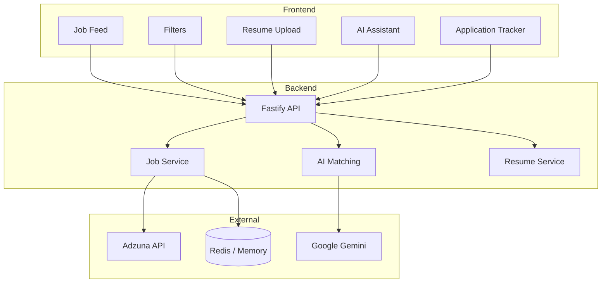

# JobMatch AI

<div align="center">


**Upload your resume. See how well you match. Apply smarter.**

[Live Demo](https://smart-job-tracker-ochre.vercel.app) • [Backend API](https://smart-job-tracker-backend-r5wd.onrender.com) • [GitHub](https://github.com/Sarfarazsfz/smart-job-tracker)

</div>

---

## What is this?

JobMatch AI started from a frustration — job hunting involves endless scrolling through listings that don't fit, wasting hours applying to roles where you're not a strong candidate.

This app connects your resume to real job listings and uses Google Gemini to score how well you match each role. Instead of guessing, you get a clear percentage and can focus your energy on applications that actually make sense.

Built during an internship assignment, but designed to solve a real problem.

> **Demo tip:** The AI matching only activates after you upload a resume. Try it — the difference in the feed is immediately noticeable.

---

## Screenshots

### 🖥️ Job Feed with AI Match Scores


### 📄 Resume Upload & Best Matches


### 🤖 AI Assistant Chat


### 📋 Application Tracker


---

## Features

**The core loop is simple:** browse jobs → upload resume → see your match scores → apply to the right ones → track where you've applied.

**Job Discovery**
- Live job feed from Adzuna API (India-focused listings)
- Filter by role, skills, date posted, job type, work mode, location, and match score
- Filters run client-side so they feel instant with no extra API calls

**AI Matching**
- Upload your resume (PDF or TXT)
- Gemini scores every job on a 0–100% scale using a weighted formula: skills (45%), experience level (30%), title relevance (25%)
- "Best Matches for You" surfaces your top results at the top of the feed
- Scores are calculated once on upload and reused — no repeated API calls while you filter

**Application Tracking**
- Smart popup when you return from an external job portal
- Asks: "Did you apply?" — because the browser can't track what happens on LinkedIn or a company site
- Honest tracking without any privacy workarounds

**AI Assistant**
- Conversational chat for job discovery and career guidance
- Powered by Gemini

---

## Tech Stack

| Layer | Tech |
|---|---|
| Frontend | React, Vite, JavaScript, CSS |
| Backend | Node.js, Fastify |
| AI | Google Gemini API |
| Caching | Upstash Redis (in-memory fallback) |
| Job Data | Adzuna API |
| Hosting | Vercel (frontend), Render (backend) |

---

## Architecture

Three clean layers with clear boundaries — frontend handles UI and client-side filtering, backend handles job fetching and AI orchestration, and external services provide data and intelligence.



---

🤖 How AI Matching Works
JobMatch AI compares your resume against job listings and generates a match score from 0–100, so you can instantly prioritize the most relevant opportunities instead of reading every posting manually.
When you upload a resume, the system extracts your skills, keywords, and role indicators, then scores each job across three dimensions:

Skills Match — how many required skills appear in your resume
Experience Alignment — how closely your experience level fits the role
Role Relevance — how similar the job title is to your background


📊 Match Score Categories
ScoreCategoryWhat It Means70 – 100✅ Strong MatchHighly relevant — prioritize these40 – 69🟡 Medium MatchModerately relevant — worth reviewingBelow 40🔴 Low MatchLess relevant — lower priority
Scores are calculated once and cached, keeping browsing fast even across many listings.

⚡ Performance & Caching
Job data is fetched from external APIs and cached to keep the app snappy and reduce redundant requests.

Jobs are cached for 1 hour using Redis
Repeated API calls are avoided on subsequent page loads
Caching keeps the experience smooth even under concurrent usage


📈 Scalability
The system is built to grow. Its current architecture supports:

Parallel job matching processing
Stateless backend (easy to scale horizontally)
Redis-based caching layer
Plug-in support for PostgreSQL or other databases
Background job processing for async workloads

---

## ⚠️ Current Limitations

This project was built as part of an internship assignment, so some production features are not included yet.

Current limitations:

- No user authentication system
- Designed for single-user usage
- Depends on external APIs for job data and AI scoring
- No permanent database storage

These limitations were intentionally kept to focus on core functionality.

---

## 🔮 Future Improvements

Planned enhancements for future versions:

- User authentication and account system
- Ability to save and manage jobs
- Email notifications for new matching jobs
- Integration with multiple job APIs
- Database integration for persistent storage
- Improved AI matching accuracy

---

## 🛠️ Setup Instructions

### Prerequisites

Make sure the following tools are installed:

- Node.js (version 18 or higher)
- npm (comes with Node.js)

---
## Tradeoffs & Known Limitations

Worth being upfront about:

- **No auth** — single-user demo model, no accounts or login
- **Ephemeral storage** — application data lives in Redis/memory, not a persistent database
- **One job source** — only Adzuna; adding more sources would significantly improve coverage
- **AI latency** — first score calculation after upload takes a few seconds, depending on Gemini response times

None of these are hard problems — they're just outside the current scope.

---

## Running Locally

**Prerequisites:** Node.js 18+, npm or yarn. API keys are optional — the app falls back gracefully without them.

```bash
git clone https://github.com/Sarfarazsfz/smart-job-tracker.git
cd smart-job-tracker

# Backend
cd backend
npm install
cp .env.example .env
# Fill in your API keys (Adzuna, Gemini, Redis — all optional)
npm run dev

# Frontend (new terminal)
cd ../frontend
npm install
npm run dev
```

Open `http://localhost:5173` — and you're good to go.

For a full list of environment variables and what each one does, see `/docs/DEPLOYMENT.md`.

---

## Docs

- `docs/API.md` — all endpoints with request/response examples
- `docs/DEPLOYMENT.md` — step-by-step production deployment guide

---

## What's Next

Things that would make this meaningfully better:

- User auth (OAuth) so multiple people can use it without stepping on each other
- PostgreSQL for persistent storage of applications and resume history
- Background job queue so AI scoring doesn't block the upload response
- Email alerts when new high-match jobs appear
- More job sources beyond Adzuna

---

## License

MIT — use it however you like.

---

<div align="center">

Built by **Md Sarfaraz Alam**

[GitHub](https://github.com/Sarfarazsfz) · [LinkedIn](https://www.linkedin.com/in/faraz4237/) · sarfaraz.alam.dev@gmail.com

If this was useful to you, a ⭐ on GitHub is appreciated.

*Last updated: February 2026*

</div>
