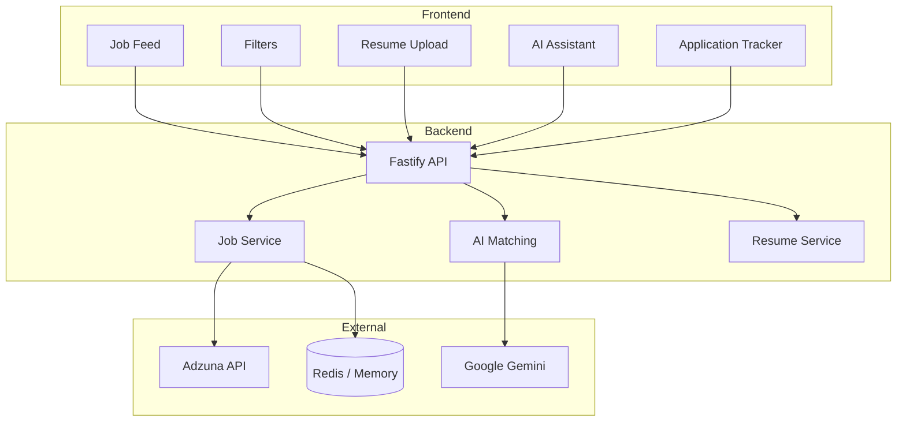

# JobMatch AI

<div align="center">


**Upload your resume. See how well you match. Apply smarter.**

[Live Demo](https://smart-job-tracker-ochre.vercel.app) • [Backend API](https://smart-job-tracker-backend-r5wd.onrender.com) • [GitHub](https://github.com/Sarfarazsfz/smart-job-tracker)

</div>

---

## What is this?

JobMatch AI started from a frustration — job hunting involves endless scrolling through listings that don't fit, wasting hours applying to roles where you're not a strong candidate.

This app connects your resume to real job listings and uses Google Gemini to score how well you match each role. Instead of guessing, you get a clear percentage and can focus your energy on applications that actually make sense.

Built during an internship assignment, but designed to solve a real problem.

> **Demo tip:** The AI matching only activates after you upload a resume. Try it — the difference in the feed is immediately noticeable.

---

## Screenshots

### 🖥️ Job Feed with AI Match Scores
<!-- Add your screenshot here -->
![Job Feed]
### 📄 Resume Upload & Best Matches
<!-- Add your screenshot here -->


### 🤖 AI Assistant Chat
<!-- Add your screenshot here -->


### 📋 Application Tracker
<!-- Add your screenshot here -->


> To add screenshots: create a `/screenshots` folder in the repo, add your images, and the paths above will work automatically.

---

## Features

**The core loop is simple:** browse jobs → upload resume → see your match scores → apply to the right ones → track where you've applied.

**Job Discovery**
- Live job feed from Adzuna API (India-focused listings)
- Filter by role, skills, date posted, job type, work mode, location, and match score
- Filters run client-side so they feel instant with no extra API calls

**AI Matching**
- Upload your resume (PDF or TXT)
- Gemini scores every job on a 0–100% scale using a weighted formula: skills (45%), experience level (30%), title relevance (25%)
- "Best Matches for You" surfaces your top results at the top of the feed
- Scores are calculated once on upload and reused — no repeated API calls while you filter

**Application Tracking**
- Smart popup when you return from an external job portal
- Asks: "Did you apply?" — because the browser can't track what happens on LinkedIn or a company site
- Honest tracking without any privacy workarounds

**AI Assistant**
- Conversational chat for job discovery and career guidance
- Powered by Gemini

---

## Tech Stack

| Layer | Tech |
|---|---|
| Frontend | React, Vite, JavaScript, CSS |
| Backend | Node.js, Fastify |
| AI | Google Gemini API |
| Caching | Upstash Redis (in-memory fallback) |
| Job Data | Adzuna API |
| Hosting | Vercel (frontend), Render (backend) |

---

## Architecture

Three clean layers with clear boundaries — frontend handles UI and client-side filtering, backend handles job fetching and AI orchestration, and external services provide data and intelligence.



---

## AI Matching — How It Works

When you upload a resume, the backend extracts your skills, experience level, and job title keywords. For each listing, Gemini compares those against the job description and returns a structured score.

The weighting:
- **Skills match** — 45% (the biggest factor, as it should be)
- **Experience level** — 30% (avoids showing senior roles to juniors and vice versa)
- **Title relevance** — 25% (keeps the feed contextually relevant)

Scores are bucketed into three tiers: **High (70–100%)**, **Medium (40–69%)**, **Low (<40%)**. You can filter by tier or see everything.

One design choice worth noting: scores are computed once on upload and cached. This keeps browsing and filtering fast, and avoids burning Gemini API quota on repeated requests.

---

## The Application Popup — A Bit of Honest Design

There's an inherent challenge with job tracking: when you click "Apply," you leave the app and go to LinkedIn or a company website. Browser security means this app cannot know whether you actually submitted an application there.

The solution is a simple popup that appears when you return to this tab, asking what happened. It's not technically clever — it's just honest about the constraint and puts the user in control. This feels better than pretending the app can track something it can't.

---

## Performance & Caching

Jobs are fetched in batches of 50 with a cache-first strategy and a 1-hour TTL. If the cache is warm, results return in milliseconds. All filtering happens client-side, so there's no latency while you refine your search — and the app stays well within Adzuna's rate limits during normal use.

---

## Tradeoffs & Known Limitations

Worth being upfront about:

- **No auth** — single-user demo model, no accounts or login
- **Ephemeral storage** — application data lives in Redis/memory, not a persistent database
- **One job source** — only Adzuna; adding more sources would significantly improve coverage
- **AI latency** — first score calculation after upload takes a few seconds, depending on Gemini response times

None of these are hard problems — they're just outside the current scope.

---

## Running Locally

**Prerequisites:** Node.js 18+, npm or yarn. API keys are optional — the app falls back gracefully without them.

```bash
git clone https://github.com/Sarfarazsfz/smart-job-tracker.git
cd smart-job-tracker

# Backend
cd backend
npm install
cp .env.example .env
# Fill in your API keys (Adzuna, Gemini, Redis — all optional)
npm run dev

# Frontend (new terminal)
cd ../frontend
npm install
npm run dev
```

Open `http://localhost:5173` — and you're good to go.

For a full list of environment variables and what each one does, see `/docs/DEPLOYMENT.md`.

---

## Docs

- `docs/API.md` — all endpoints with request/response examples
- `docs/DEPLOYMENT.md` — step-by-step production deployment guide

---

## What's Next

Things that would make this meaningfully better:

- User auth (OAuth) so multiple people can use it without stepping on each other
- PostgreSQL for persistent storage of applications and resume history
- Background job queue so AI scoring doesn't block the upload response
- Email alerts when new high-match jobs appear
- More job sources beyond Adzuna

---

## License

MIT — use it however you like.

---

<div align="center">

Built by **Md Sarfaraz Alam**

[GitHub](https://github.com/Sarfarazsfz) · [LinkedIn](https://www.linkedin.com/in/faraz4237/) · sarfaraz.alam.dev@gmail.com

If this was useful to you, a ⭐ on GitHub is appreciated.

*Last updated: February 2026*

</div>
