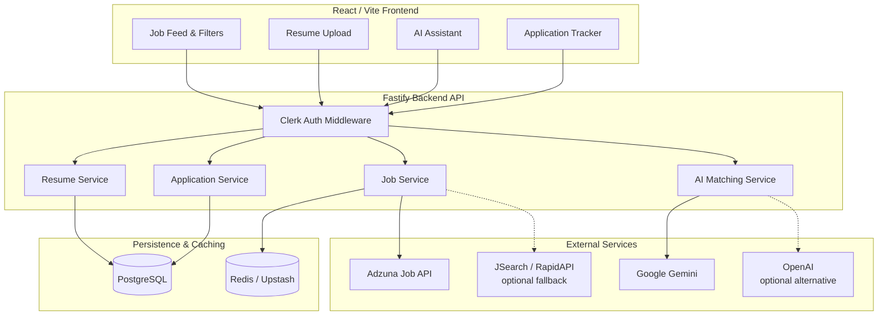

# JobMatch AI

Production-style full-stack application demonstrating AI integration, caching strategy, and persistent data storage for a real job-search workflow.

<div align="center">


**AI-powered job matching platform that scores resume relevance against real job listings.**

[Live Demo](https://smart-job-tracker-ochre.vercel.app) • [Backend API](https://smart-job-tracker-backend-r5wd.onrender.com) • [GitHub](https://github.com/Sarfarazsfz/smart-job-tracker)

</div>

---

## Overview

JobMatch AI is an AI-assisted job discovery platform that analyzes a user's resume and ranks live job listings by relevance. Instead of manually reviewing hundreds of postings, users get a quantified match score to prioritize which jobs to apply to first.

The system connects resumes to live job listings, uses AI to score relevance, tracks which jobs a user has applied to, and persists that history in PostgreSQL — so it survives page reloads and sessions.

> **Demo tip:** AI matching activates once you upload a resume.

---

## Screenshots

### 🖥️ Job Feed with AI Match Scores


### 📄 Resume Upload & Best Matches


### 🤖 AI Assistant Chat


### 📋 Application Tracker


---

## Key Features

**The core loop:** browse jobs → upload resume → see match scores → apply → track where you've applied — with your applications and resume persisted across sessions.

**Job Discovery**
- Live job feed sourced from the Adzuna API (India-focused listings)
- Filter by role, skills, date posted, job type, work mode, location, and match score
- Filtering runs client-side for instant results with no extra API calls

**AI Matching**
- Upload your resume (PDF or TXT)
- Google Gemini scores each job on a 0–100% scale using a weighted formula: skills (45%), experience level (30%), title relevance (25%)
- "Best Matches for You" surfaces top results at the top of the feed
- Scores are calculated once per upload and reused, avoiding repeated AI calls

**Application Tracking**
- Prompts users to confirm whether they applied after returning from an external job portal (the browser can't observe activity on LinkedIn or a company's site)
- Application records — job, status, timeline — are written to **PostgreSQL**, so they persist across sessions and page reloads
- One application record per user/job pair, enforced at the database level

**AI Assistant**
- Conversational chat for job discovery and career guidance, powered by Gemini

**Authentication**
- Sign-in and session management handled by **Clerk** (Email + Google)
- Match scoring, resume upload, and application tracking are available to signed-in users

---

## Tech Stack

| Layer | Technology |
|---|---|
| Frontend | React, Vite, JavaScript, CSS |
| Backend | Node.js, Fastify |
| Database | PostgreSQL (`pg`) |
| Caching | Redis (Upstash), optional — falls back to in-memory |
| Authentication | Clerk |
| AI | Google Gemini (primary), OpenAI (optional alternative) |
| Job Data | Adzuna API (primary), RapidAPI JSearch (optional fallback) |
| Hosting | Vercel (frontend), Render (backend) |

---

## Architecture

The system is split into three layers: a React/Vite frontend, a stateless Fastify API, and the external/persistence services it depends on. See [`docs/ARCHITECTURE.md`](docs/ARCHITECTURE.md) for the full diagram and data flow.


```mermaid
graph TB
    subgraph Frontend [React / Vite Frontend]
        UI[Job Feed & Filters]
        Resume[Resume Upload]
        Chat[AI Assistant]
        Tracker[Application Tracker]
    end

    subgraph Backend [Fastify Backend API]
        Auth[Clerk Auth Middleware]
        JobService[Job Service]
        AIService[AI Matching Service]
        ResumeService[Resume Service]
        AppService[Application Service]
    end

    subgraph Data [Persistence & Caching]
        Postgres[(PostgreSQL)]
        Cache[(Redis / Upstash)]
    end

    subgraph External [External Services]
        JobAPI[Adzuna Job API]
        JSearch[JSearch / RapidAPI<br/>optional fallback]
        Gemini[Google Gemini]
        OpenAI[OpenAI<br/>optional alternative]
    end

    UI --> Auth
    Resume --> Auth
    Chat --> Auth
    Tracker --> Auth

    Auth --> JobService
    Auth --> AIService
    Auth --> ResumeService
    Auth --> AppService

    JobService --> JobAPI
    JobService -.-> JSearch
    JobService --> Cache
    AIService --> Gemini
    AIService -.-> OpenAI
    ResumeService --> Postgres
    AppService --> Postgres
```

**Design decisions:**
- **Cache-first job fetching** — job listings are cached in Redis (when configured) to reduce Adzuna API calls and avoid rate limits; if Redis isn't configured, the Job Service falls back to in-memory caching.
- **Persistent user data** — resumes and application history are stored in PostgreSQL, so they're not lost between sessions (unlike job listing data, which is treated as a refreshable cache).
- **Stateless backend** — the API itself holds no session state, so it can scale horizontally; state lives in Postgres and Redis.
- **Single-pass AI scoring** — a resume is scored once per upload and the result reused, avoiding repeated Gemini calls.
- **Client-side filtering** — filtering happens in the browser for instant UX and less backend load.
- **Provider fallbacks** — RapidAPI's JSearch and OpenAI are configured as optional fallback/alternative providers to Adzuna and Gemini, respectively.

---

## Data Flow

1. User signs in via Clerk and uploads a resume from the frontend.
2. The resume is sent to the backend API and stored in PostgreSQL (`resumes` table).
3. The backend extracts skills/keywords and fetches job listings (from Redis cache when available, otherwise from Adzuna).
4. The AI matching service (Gemini) scores each job against the resume.
5. The frontend displays ranked jobs with match scores.
6. When a user marks a job as applied, that record is written to PostgreSQL (`applications` table), including status and timeline.

---

## AI Matching — How It Works

Each job is scored against the uploaded resume using a weighted formula:

| Factor | Weight | What it checks |
|---|---|---|
| Skills Match | 45% | Overlap between resume skills and job requirements |
| Experience Level | 30% | Whether resume experience aligns with the role |
| Title Relevance | 25% | Similarity between resume profile and job title |

### Match Categories

| Score | Category | Meaning |
|---|---|---|
| 70–100% | Strong Match | Highly relevant to the user's profile |
| 40–69% | Medium Match | Partially relevant |
| Below 40% | Low Match | Less relevant |

---

## Performance & Caching

When `UPSTASH_REDIS_REST_URL` / `UPSTASH_REDIS_REST_TOKEN` are configured, Redis caches job listings, significantly reducing response time on repeat fetches and cutting down on repeated calls to the Adzuna API — which helps avoid rate limits and keeps the job feed responsive. If Redis isn't configured, the Job Service falls back to in-memory caching instead. Exact improvement will vary by environment and cache state, so no fixed benchmark number is quoted here — the underlying design goal is fewer external API round-trips and faster repeat loads.

Additional performance-relevant decisions:
- Resume match scores are computed once per upload and reused, rather than recalculated on every filter change.
- Filtering and sorting run client-side, so they don't hit the backend at all.

---

## Persistence

| Data | Store | Notes |
|---|---|---|
| Job listings | Redis (cache), optional — falls back to in-memory | Refreshable; not treated as source of truth |
| Resumes | PostgreSQL (`resumes` table) | One resume per user, keyed on `user_id` |
| Applications | PostgreSQL (`applications` table) | Unique per `(user_id, job_id)`; includes status and a JSON timeline |

Schema is initialized via `npm run db:init` (backend), which runs the project's `schema.sql`.

---

## Security & Authentication

- Authentication and session handling are managed by **Clerk** (Email + Google sign-in).
- API routes that touch user-specific data (resume upload, match scoring, applications) require an authenticated session.
- User-scoped data (resumes, applications) is looked up by `user_id`, so one user cannot read another's records through the API.

---

## Setup Instructions

### Prerequisites
- Node.js 18+
- npm (or yarn)
- A PostgreSQL database (local or hosted, e.g. Render/Supabase/Neon)

### Local Development

```bash
git clone https://github.com/Sarfarazsfz/smart-job-tracker.git
cd smart-job-tracker

# Backend
cd backend
npm install
cp .env.example .env
# Fill in DATABASE_URL plus your API keys (Adzuna, Gemini, Redis, Clerk)
npm run db:init   # initializes the PostgreSQL schema
npm run dev

# Frontend (new terminal)
cd ../frontend
npm install
npm run dev
```

Open `http://localhost:5173`.

### Environment Variables

All variable names below are unchanged from the project's `backend/.env.example`.

| Variable | Required | Purpose |
|---|---|---|
| `PORT` | No (defaults to `3001`) | Backend server port |
| `FRONTEND_URL` | No (defaults to `http://localhost:5173`) | Used for CORS |
| `DATABASE_URL` | **Yes** | PostgreSQL connection string. Backend throws on startup if missing, outside `NODE_ENV=test` |
| `ADZUNA_APP_ID`, `ADZUNA_APP_KEY` | Primary job source | Adzuna API credentials |
| `RAPIDAPI_KEY` | Optional | JSearch API — secondary/fallback job source |
| `GEMINI_API_KEY` | Primary AI provider | Google Gemini — job scoring & chat |
| `OPENAI_API_KEY` | Optional | Alternative to Gemini |
| `CLERK_SECRET_KEY` | Yes | Backend token verification |
| `CLERK_PUBLISHABLE_KEY` | Yes | Used by the auth config on the backend |
| `UPSTASH_REDIS_REST_URL`, `UPSTASH_REDIS_REST_TOKEN` | Optional | Falls back to in-memory caching if not set |

For a full list of endpoints, see `docs/API.md`. For production deployment steps, see `docs/DEPLOYMENT.md`.

---

## Deployment

- **Frontend** — deployed on **Vercel**.
- **Backend** — deployed on **Render**.
- **Database** — PostgreSQL instance (e.g. Render PostgreSQL), connected via `DATABASE_URL`. The backend enables SSL automatically for any connection string that isn't pointing at `localhost`/`127.0.0.1`, which matches typical hosted-Postgres setups without needing a separate SSL flag.
- **Cache** — Redis via Upstash (optional; falls back to in-memory if not configured).

See `docs/DEPLOYMENT.md` for step-by-step deployment instructions.

---

## Project Highlights

- End-to-end AI matching pipeline: resume upload → parsing → Gemini scoring → ranked results.
- Real persistence layer (PostgreSQL) for applications and resumes, not just in-memory state.
- Cache-first architecture (Redis) in front of an external job API to reduce redundant calls.
- Authenticated, per-user data isolation via Clerk.
- Stateless backend design that can scale horizontally.

---

## Current Limitations

- **Adzuna as primary job source** — RapidAPI's JSearch is available as a secondary fallback, but listing coverage is still centered on Adzuna.
- **AI latency** — the first score calculation after a resume upload takes a few seconds, depending on the AI provider's (Gemini or OpenAI) response time.

---

## Future Improvements

- Additional job source integrations beyond Adzuna
- Saved/bookmarked jobs
- Email notifications for new high-match jobs
- Background job queue so AI scoring doesn't block the upload response
- Improved AI matching accuracy

---

## License

MIT — use it however you like.

---

<div align="center">

Developed by **Md Sarfaraz Alam**

[GitHub](https://github.com/Sarfarazsfz) · [LinkedIn](https://www.linkedin.com/in/faraz4237/) · sarfaraz.alam.dev@gmail.com

If you find this project useful, consider giving it a ⭐

</div>